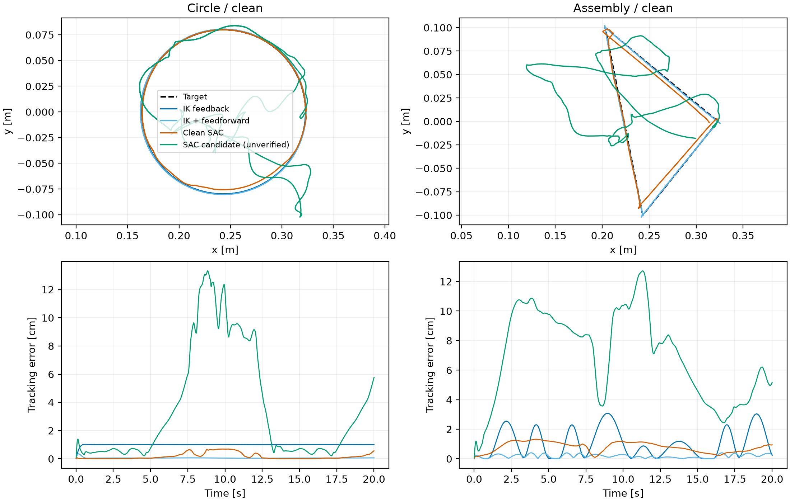
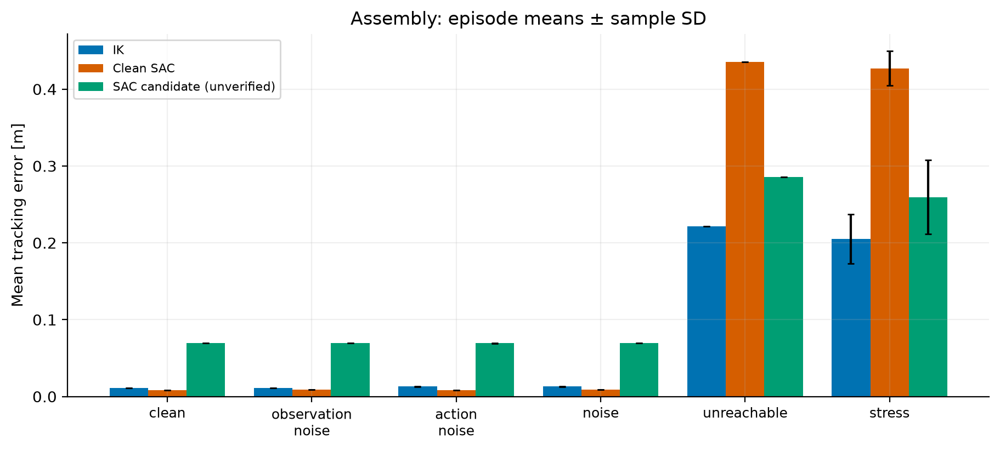
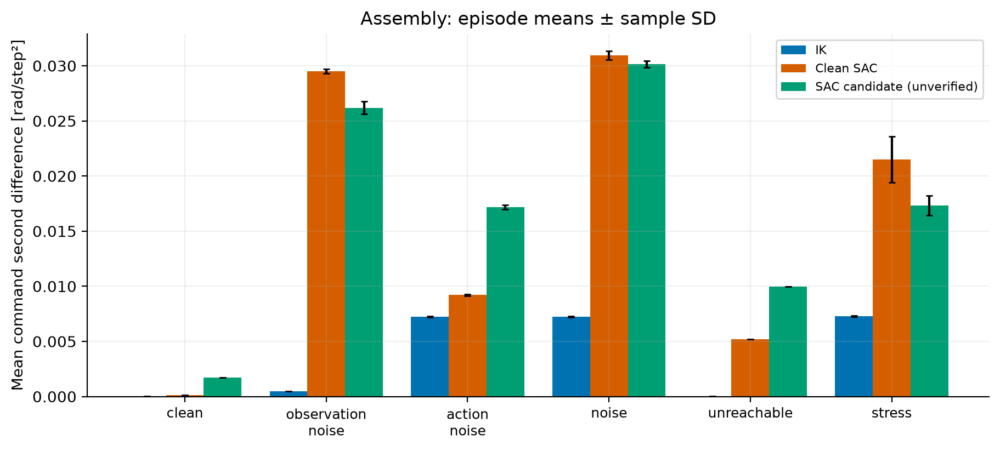

# Franka Panda: classical IK vs SAC trajectory tracking

This project asks how a known-model Jacobian controller compares with a learned
Soft Actor-Critic (SAC) controller on Cartesian tracking, new trajectories and
uncertainty. It continues the original MuJoCo/Gymnasium project and preserves its
trained checkpoints and historical results.

The evaluation pipeline is implemented and measured results are included. **A
verified disturbance-trained checkpoint is not available:** the root best model
has uncertain provenance and is reported as `candidate_sac`. Its results cannot
establish the effect of disturbance training. No new training was performed.

## Quick start

Use Python 3.12 and run commands from this directory. From the supplied workspace,
first `cd franka-panda-sac-tracking-main`. For a standalone clone of this project,
use its repository root instead.

```powershell
python -m venv .venv
.\.venv\Scripts\Activate.ps1
python -m pip install -r requirements-evaluation-lock.txt
git clone https://github.com/google-deepmind/mujoco_menagerie.git mujoco_menagerie
git -C mujoco_menagerie checkout c96a32d28fb5da84da38c1da4d749e7a13212855
python -m unittest -v test_benchmark
python evaluate_controllers.py --episodes 5 --seed 42 --duration 20
```

On Linux/macOS activate with `source .venv/bin/activate`. Evaluation is headless;
no viewer or GPU is required. `requirements.txt` lists the tested main packages
and optional historical-training TensorBoard dependency; the evaluation lock
records the complete tested package set. The original freeze is preserved as
`requirements-original.txt`.

Menagerie can also be a sibling directory, or specified explicitly with
`--model-path /path/to/franka_emika_panda/scene.xml` or `PANDA_MODEL_PATH`.
The model's external mesh files must remain beside its XML files.
The two small best checkpoints must be included in a clone:

- `Original_SAC/models_clean/best_model/best_model.zip`: clean SAC, 640,000 steps.
- `models/best_model/best_model.zip`: unverified candidate, 160,000 steps.

Missing checkpoints fail explicitly; `--controllers ik` needs no SAC checkpoint.
Evaluation never trains, changes, or saves a policy. Existing output directories
are refused; omit `--output` for a unique timestamped directory under `results/`.

## Architecture and audit

See [AUDIT.md](AUDIT.md) for the inspection and limitations of historical scripts.

```text
Original_SAC/                 Original clean environment, training/playback and models
Noisy_SAC/                    Original uncertain environment and training/playback
backup_original_sac/          Preserved historical code and checkpoint duplicates
Testing/                      Earlier 20-input prototype (not compatible with saved SAC)
circle_ik_panda.py             Preserved original interactive feedforward IK demo
trajectories.py               Shared circle and smooth assembly position/velocity reference
benchmark.py                  Shared plant (subclasses clean environment), DLS IK, metrics
evaluate_controllers.py       Paired rollouts, checkpoint loading, CSVs, traces and manifests
plot_results.py               Automatic PNG/PDF plots and data-driven report
summarize_experiments.py       Matched feedback/feedforward comparison table and figure
assembly_config.json          Editable waypoint offsets, phase weights, circle parameters
test_benchmark.py             Numerical, Gymnasium and reproducibility checks
artifact_inventory.json       SHA-256 inventory of 141 preserved historical artifacts
results/reference/            180 episodes: 2 paths x 6 conditions x 3 controllers x 5 seeds
results/ik_feedforward/        60 episodes using original IK feedforward law
results/training_horizon/     3 clean-circle episodes at the original 5-second horizon
results/comparison/           Combined table and figure
```

The new evaluator reuses the clean environment's robot reset, observation layout,
command integration, joint limits and simulation stepping. The only change to its
legacy constructor adds an optional XML path. The benchmark subclass refreshes
kinematics after each step so position errors use the final simulation time,
fixing the legacy one-physics-step Cartesian sampling lag. Historical demos and
training scripts are retained as inspected legacy entry points, not validated
comparison commands. They use cwd-relative output paths and can overwrite shared
training destinations; use separate working/output directories if adapting them.

## MDP, SAC and reward

The underlying state includes robot positions/velocities, command integrator,
reference clock and previous action. The existing policy sees 32 float32 values:

| Slice | Input |
|---|---|
| 0:7 | Arm joint positions, rad |
| 7:14 | Arm joint velocities, rad/s |
| 14:17 | Hand-body origin XYZ, m |
| 17:20 | Target XYZ, m |
| 20:23 | Target minus actual XYZ, m |
| 23:25 | sin(0.5 t), cos(0.5 t) by default |
| 25:32 | Commanded joint positions, rad |

The seven normalized actions are clipped to [-1, 1]. Each updates a position
servo target by `0.04 * action` rad per control step and is then clipped to the
XML joint limits. This is joint-position-target control, not torque control.
The reward, using L2 norms and the executed action `a`, is exactly:

```text
r = -10 ||target - hand|| - 0.01 ||a|| - 0.02 ||a - previous_a||
    - 0.001 ||joint_velocity|| + 0.5 * (||target - hand|| < 0.03)
```

There is no error clipping or additional 5/8 cm reward bonus in the supplied code.
Previous action is not itself an observation, so the observation is not the full
Markov state for reward accounting. Observation noise and unseen trajectories
introduce further partial observability.

[SAC](https://arxiv.org/abs/1801.01290) is an off-policy, entropy-regularized
actor-critic method. The original scripts use SB3 `MlpPolicy`, learning rate
3e-4, replay capacity 200,000, batch size 256, gamma .99, tau .005, automatic
entropy coefficient, 5,000 warmup steps and one gradient step per interaction.
They request 1M training steps and evaluate every 10,000 steps. The saved policies
use the default 256-by-256 MLPs and deterministic inference for this benchmark.
Training seeds and exact historical model-asset revision are not recorded.

## Classical IK

The baseline reuses the original damped least-squares law:

```text
v = kp * measured_position_error [+ target_velocity for feedforward run]
dq = J.T @ solve(J @ J.T + damping**2 * I, v)
q_command += clip(dq, -1, 1) * control_dt
```

`kp=4 /s`, damping=.05, Cartesian speed cap=.35 m/s and internal per-joint command
velocity cap=1 rad/s are retained from the original demo. The controller computes
the hand's translational Jacobian at measured joint positions using a separate
MuJoCo scratch state. It does not get privileged true joint positions/error under
observation noise. Orientation is unconstrained, as for SAC.

The default `ik` evaluation omits feedforward because SAC has no target-velocity
input. The separate `--ik-feedforward` run restores the original controller's
analytic reference velocity, including on assembly segments. Both are reported:
SAC has phase features from which circle velocity can be inferred, so removing
IK feedforward is an ablation, not proof of equal information. The feedforward
run uses known reference motion; it is the relevant engineering baseline when
that reference is available. IK's internal 1 rad/s cap is a controller choice;
all methods face the same plant action envelope (up to .04 rad/step = 4 rad/s of
command change). There is no common hard cap on actual measured joint speed.

## Shared trajectories

The circle has radius .08 m and angular speed .5 rad/s. Its centre is offset
-.08 m in X from the initial hand origin, so it starts without a target jump.
The default 20-second episode covers approximately 1.6 revolutions.

The assembly-inspired path is a **position tracking experiment only**. It has no
grasp, component, fixture contact, insertion forces or orientation objective.
Eleven phases are home, approach pick, descend, dwell, lift, transfer, approach
insertion, slower insertion descent, dwell, retract and return home. Each segment
uses `10u^3 - 15u^4 + 6u^5`, with zero velocity/acceleration at both ends. Dwell
segments hold position. Default phase weights sum to 25 and scale to the requested
episode duration; insertion lasts twice as long as pickup descent.

Offsets are relative to the home hand position. With the pinned model, the path
lies within X=[.203,.323], Y=[-.100,.100], Z=[.634,.764] m. This is a small free-space
trajectory, not a validation of the Panda's whole workspace. Edit
[assembly_config.json](assembly_config.json) and pass `--trajectory-config` to
change offsets, clearance, phase durations, radius or frequency. Shortening the
assembly duration also increases reference speed; the .2-second smoke test checks
execution only and is not a meaningful tracking benchmark.

## Experimental methodology and uncertainty

All methods use the same home q=[0,-.7,0,-2,0,1.6,.7], finger initialization,
model, XML limits, .002-second physics timestep, frame skip 5, .01-second control
interval, trajectories and full episode duration. Metrics are sampled after
physics, including initial transients. Reference values are true/noiseless for
scoring. SAC inference runs on CPU with one Torch thread.

| Condition | Observation noise | Normalized action noise | Target |
|---|---:|---:|---|
| clean | 0 | 0 | reachable reference |
| observation_noise | .002 | 0 | reachable reference |
| action_noise | 0 | .05 | reachable reference |
| noise | .002 | .05 | reachable reference |
| unreachable | 0 | 0 | translated far reference |
| stress | .002 | .05 | far reference with .03 m episode jitter |

Noise is independent zero-mean Gaussian. Like the original uncertain environment,
the same numeric observation standard deviation applies to all 32 mixed-unit
entries; errors and positions are perturbed independently. This is a synthetic
robustness test, not a calibrated sensor model. Action noise is applied before the
shared clipping/integration, so equal normalized std .05 corresponds to .002 rad
command-increment std before clipping. Clipping can cause different effective
noise for saturated policies.

Unreachable circles are centred at [1.05,0,.45] m; assembly gets the same translation.
Stress jitter is sampled once per episode. The original trainer used 20% unreachable
episodes; evaluation separates reachable and far-target conditions instead of
mixing them and hiding failure in an average. Far-target status is a designed test,
not a solved global reachability certificate. Seeds 42-46 are paired across
controllers, with separate target, observation and action RNG streams. Deterministic
clean/unreachable runs repeat identically; five copies are not five independent
training runs. SD summarizes episode variability, not statistical significance.

### Metrics and files

Each run saves `episodes.csv`, `summary.csv`, `manifest.json`, `report.md`, `traces/*.npz`
and `plots/*.png` plus vector PDFs. The manifest records source/model/asset hashes,
packages, seed, configuration, timestep and checkpoint training-step metadata.
Raw traces include target/actual XYZ, phase, joint positions, commands and raw/executed
actions so post-processing can be checked without running the simulator again.
The approximately 140 MB of full-run traces are preserved locally but excluded
from Git; rerun evaluation to regenerate them in a clean clone. CSV summaries,
reports, manifests, plots and both best checkpoints remain versionable.

Tracking metrics are mean error, RMSE, maximum, 95th percentile, fractions below
3 and 5 cm, and closest achieved distance. Smoothness includes mean L2 action
change, command change and command second difference. Speed is the L2 norm across
seven joint velocities (not an individual-joint average). Joint/command limit
occupancy is the fraction of joint-time samples within .01 rad of either limit
or beyond it. Action clipping is the fraction of noisy action components outside
[-1,1] before clipping; it is not policy saturation. SAC reward totals use the
same reward formula. Inference timings exclude physics and I/O and include Python
overhead; concurrent benchmark runs make them approximate, not a hardware study.
Summary values are means of episode metrics, with sample SD; e.g. averaged maxima
are not the single worst sample across all episodes. Closest distance is an
instantaneous minimum to the moving target, not an optimization-based reachability
bound. No single metric alone establishes stability or safety.

## Measured results

Generated from `results/reference/summary.csv` and `results/ik_feedforward/summary.csv`
using `python summarize_experiments.py`. These are evaluation results for the
supplied weights, not estimates of SAC training-seed variability.

| Trajectory | Condition | IK feedback | IK + feedforward | Clean SAC | SAC candidate* |
|---|---|---:|---:|---:|---:|
| circle | clean | 1.00 ± 0.00 | 0.06 ± 0.00 | 0.17 ± 0.00 | 3.55 ± 0.00 |
| circle | observation_noise | 1.00 ± 0.00 | 0.07 ± 0.00 | 0.31 ± 0.01 | 3.43 ± 0.05 |
| circle | action_noise | 1.15 ± 0.04 | 0.57 ± 0.05 | 0.18 ± 0.01 | 3.47 ± 0.05 |
| circle | noise | 1.14 ± 0.04 | 0.57 ± 0.04 | 0.31 ± 0.01 | 3.63 ± 0.11 |
| circle | unreachable | 22.32 ± 0.00 | 22.29 ± 0.00 | 45.70 ± 0.00 | 28.46 ± 0.00 |
| circle | stress | 20.71 ± 3.22 | 20.69 ± 3.22 | 44.99 ± 2.09 | 28.28 ± 4.98 |
| assembly | clean | 1.07 ± 0.00 | 0.18 ± 0.00 | 0.79 ± 0.00 | 6.94 ± 0.00 |
| assembly | observation_noise | 1.08 ± 0.00 | 0.19 ± 0.00 | 0.86 ± 0.00 | 6.95 ± 0.01 |
| assembly | action_noise | 1.29 ± 0.05 | 0.59 ± 0.06 | 0.80 ± 0.01 | 6.94 ± 0.02 |
| assembly | noise | 1.29 ± 0.05 | 0.59 ± 0.06 | 0.87 ± 0.01 | 6.95 ± 0.02 |
| assembly | unreachable | 22.13 ± 0.00 | 22.05 ± 0.00 | 43.53 ± 0.00 | 28.53 ± 0.00 |
| assembly | stress | 20.53 ± 3.22 | 20.44 ± 3.22 | 42.71 ± 2.25 | 25.96 ± 4.84 |

Mean Cartesian error in cm ± sample SD across episode means. *Training provenance unverified.
Assembly SAC is zero-shot; IK feedforward receives analytic reference velocity.




The top panels show XY projections; vertical segments overlap there. Full XYZ
plots and time histories are available in each run's plots directory.




[Full metrics and generated observations](results/reference/report.md) ·
[Feedforward metrics](results/ik_feedforward/summary.csv) ·
[All per-episode metrics](results/reference/episodes.csv)

## Engineering interpretation

For the 20-second clean paths, IK with feedforward gives the lowest mean error
(circle .06 cm, assembly .18 cm), requires no learned policy, and produces smoother
commands than the saved SAC controllers. Feedback-only IK has approximately 1 cm
lag; clean SAC beats that ablation on both paths. This demonstrates why the
controller's reference information must be stated when claiming an advantage.

Clean SAC is especially strong on its original 5-second clean-circle horizon:
mean error is .018 cm in [that separate run](results/training_horizon/summary.csv),
versus .17 cm over 20 seconds. The full-horizon candidate error rises from .54 cm
at 5 seconds to 3.55 cm at 20 seconds. Longer rollouts probe time/phase coverage
beyond the original training horizon, even on the same circle. On the 20-second
circle with action noise, clean SAC (.18 cm) beats feedforward IK (.57 cm); on noisy
assembly, feedforward IK (.59 cm) beats clean SAC (.87 cm). Robustness is task- and
noise-dependent, not a universal ranking.

Circle-trained clean SAC tracks the assembly reference at .79 cm mean error and
stays within 3 cm throughout this clean test, showing useful local zero-shot
transfer. That does not make it an assembly-trained policy. Its phase features
retain their circle meaning, it sees no future waypoint/phase label or desired
velocity, and a circle-only training distribution does not identify the dynamics
of arbitrary target motion. The assembly reference is close to home; success here
does not imply generalization over the full workspace or manipulation tasks.

For infeasible circular targets, feedback IK has mean error 22.32 cm, no measured
joint-limit occupancy, and mean joint-speed norm .164 rad/s. Clean SAC has 45.70 cm
mean error, 54.37% joint-limit occupancy and .578 rad/s mean speed norm; its peak
speed norm is 8.44 rad/s. The candidate is closer (28.46 cm) than clean SAC and has
6.83% limit occupancy, but is more active (1.389 rad/s mean speed norm). In the same
test, mean command second differences are approximately .00004, .00185 and .00803
rad/step² for IK, clean SAC and candidate respectively. Thus a lower distance alone
would hide aggressive command behaviour. These are descriptive stability indicators,
not a proof of stability or a real-robot safety validation.

The candidate shows poorer nominal accuracy and better far-target distance than
clean SAC, but **this cannot be attributed to disturbance training**. Its training
provenance is unknown, it has a different training-step count, and only one policy
of each type is present. A verified checkpoint can be evaluated without changing
the pipeline; matched multi-seed training would be needed for causal robustness
claims.

On this runtime, mean inference is roughly .07-.09 ms for IK and .27-.30 ms for
SAC. Both are small relative to the 10 ms control interval; these timings are
approximate. SAC also incurred at least the interactions recorded in its checkpoint
(640k clean; 160k candidate), while IK requires no training. Historical wall-clock
training cost was not measured reliably here, so no hours/GPU-cost claim is made.

For these known-kinematics free-space paths, the measured accuracy, smoothness and
absence of training cost make feedforward DLS a strong engineering starting point.
SAC remains interesting when optimizing objectives or dynamics that are hard to
encode analytically, including learned residual compensation or contact-rich
objectives. Those possibilities are future hypotheses, not benefits demonstrated
by this position-only experiment.

## Reproducing each experiment

A minimal all-controller smoke test creates metrics and plots quickly:

```powershell
python evaluate_controllers.py --episodes 1 --duration 0.2 --conditions clean stress
```

Full benchmark (both paths; all six conditions):

```powershell
python evaluate_controllers.py --episodes 5 --seed 42 --duration 20 --output results/my_reference
python evaluate_controllers.py --controllers ik --ik-feedforward --episodes 5 --seed 42 --duration 20 --output results/my_feedforward
python summarize_experiments.py --reference results/my_reference --feedforward results/my_feedforward --output results/my_comparison
```

Individual experiments:

```powershell
python evaluate_controllers.py --trajectories circle --conditions clean --duration 5 --episodes 1
python evaluate_controllers.py --trajectories assembly --conditions clean --trajectory-config assembly_config.json
python evaluate_controllers.py --conditions observation_noise action_noise noise --obs-std 0.002 --action-std 0.05
python evaluate_controllers.py --conditions unreachable stress --episodes 10 --seed 100
python evaluate_controllers.py --controllers ik --ik-feedforward
```

Once training provenance is verified, evaluate a disturbance-trained checkpoint:

```powershell
python evaluate_controllers.py --controllers ik clean_sac disturbed_sac --disturbed-model path/to/verified_best_model.zip
```

The evaluator requires that explicit path and never relabels the candidate silently.
The report and plots then show clean vs disturbance-trained SAC. Changing `--seed`,
`--episodes`, `--duration`, `--frame-skip` or trajectory configuration starts a new
experiment; changed control timing also changes SAC's effective action rate, so
keep the trained frame skip for the reported comparison.

## Validation, limitations and future work

Five tests pass: legacy circle equivalence; assembly position/velocity continuity;
seeded rollout equality, limits and duration; Gymnasium observation/step contract
and synchronized Cartesian state; paired target/action noise and metric consistency.
The smoke test exercised checkpoint loading, both paths, disturbances, reports and
plots. There are 243 full/supplementary recorded episodes, plus 12 smoke episodes.
All 141 original checkpoint/result artifacts were verified against the supplied ZIP.

Limitations include no orientation or physical assembly objective, known-model IK,
synthetic mixed-unit noise, no actuator delay/model mismatch, only two saved policy
instances, unknown candidate provenance, no training-seed study, and a current
Menagerie/runtime rather than the unrecoverable original runtime. Joint-limit
clipping is not a safety controller. The phase-conditioned observation does not
fully describe unseen waypoint motion. No long training was launched.

Future work: recover verified disturbance-training provenance; run matched training
seeds; validate a short assembly-training smoke test before any long training;
sample diverse waypoint trajectories with target velocity/phase context; add
orientation, delays/model error and contact objectives; compare residual SAC with
IK; validate a hold/stop policy for infeasible commands.

Demo placeholders (no videos are claimed to exist): clean circle GIF, assembly
tracking video and unreachable-target comparison video. Historical PNG figures
remain in the original folders; final benchmark plots live under `results/`.

Robot assets: [Google DeepMind MuJoCo Menagerie](https://github.com/google-deepmind/mujoco_menagerie),
revision `c96a32d28fb5da84da38c1da4d749e7a13212855` for these measurements.

Original project author: Idris Muzaffar Ariff, MSc Advanced Mechanical Engineering,
Imperial College London.
